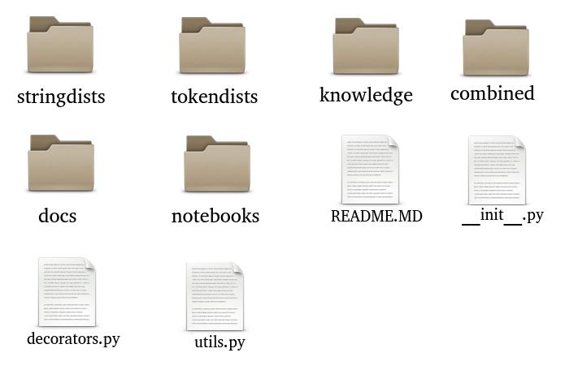

## "Text Similarity Python support on Debian"

##### [Textsim](https://github.com/sorice/textsim) a proposal for students and entrepeneurs

###### [Abel Meneses-Abad](http://menesesabad.com) / [@abelma1980](https://twitter.com/abelma1980?lang=es)
________________________

##### Slides to Present in [DebConf](), July, 2019

##### Collaborator: [Leonel Salazar Videaux](http://debianhlg.cubava.cu/)
________________________

###### Get the [presentation](https://github.com/sorice/NLPdebconf2019) source code.

###### Under [Attribution 4.0 International](http://creativecommons.org/licenses/by/4.0/) License.

---

### About the Author

####- 2004 BSc on Telecommunications and Electronics
####- 2005-09 Research on FLOSS Development & Deployment
####- 2006-12 SCRUM of many free software projects for high education: SistClon, Infodrez, Shakespeare and Sunshine.
####- 2009 Chairman of Free Software Committee, Informática-Habana 2009
####- Member of the Cuban Free Technologies Users Group (GUTL) from 2009 - 2019
####- 2009-13 Dir. of Center for Studies of FLOSS for Culture, Granma, Cuba
####- From 2012 PhD candidate on Computing Science in the field of NLP

---

## Open Science needs
- technologies as __infrastructure__ that support open practices like: reproducibility.
- __simplicity__ that help normal citizens to contribute
- to be __cheaper__ on the 3rd world

## Goal of this presentation

To present the experience of a free software python library for text similarity that is trying to integrates all current implemented distances

---

## What is all about?

##### _Doing NLP for Humans_

- _Text similarity_ | _Applications _
- Current technologies for Text Similarity
- Textsim

---

## Text Similarity

>"Text similarity is the task of determining the degree of similarity between two texts."
#### A Composite Model for Computing Similarity Between Texts (Bar, 2013)

Text Similarity research is focused today on semantic similarity

>“Automatically acquiring a relative measure of how similar two words are”
#### Foundations of Statistical NLP (Manning, 1999)

--

### Types of Text Similarity

- __Character based__ -> used to compare genetic objects
- __Token based__ -> lexical level & syntactic level
  - calculate _the exact similarity between two groups of words_
- __Semantic based__ -> based on word meanings
  - calculate _the meaning similarity of two words_
- __Combined__ -> Ej Semantic & Syntactic
  - _calculate the sim between meanings of the verbs of two sentences_
- Others like __Corpus based__

### 
#### [Technologies for Text Similarity](#/5/0) (*click[→](#/5/0)*)
#### [Text Similarity Applications](#/4/2) (*click [↓](#/4/2)*)

--

### Text Similarity Applications

- Machine Translation
- Question Answering
- Information Retrieval
- Summarization
- Natural Language Generation
- Text Reuse & Plagiarism Detection
- Others...

--

### Text Similarity Distance Examples

- __character based:__ LCS, Jaro, Levenshtein, Needleman,... 
- __token based:__ Block, Cosine, Dice, Jaccard, Euclidean,... 
- __Semantic based:__ Wu, Pekar, Resnik, Lin,...
- __combined:__ Cos&N-grams, Jaccard+SNgram,...
- __Corpus based:__ LSA, ESA, GLSA, NGD,... 
####[(also known as embedding models)]()

.
#### A Survey of Text Similarity Approaches (Gomaa, 2013)

--

Text Similarity __is important__

Text Similarity today __is complex__


---
## Technologies for Text Similarity

The main __problem__ is that all the [resources are spread]() over multiple and complex
libraries, without the complete set of distances.

--

### Resources for Text Similarity on:

- __java__: DkPro_Similarity, Stanford_NLP, others...
- __C++__: Freeling, others...
- the same in R, and the rest of the programming langs with NLP intentions

#### [python situation](#/5/2) = high level of complexity (click [↓](#/5/2))

--

### The python ecosystem for Text Similarity

- NLTK
- Sklearn
- Scipy
- Spacy
- textdistance
- jellyfish
- Pattern
- NLPToolkit
- and so on...

#### Current details about these projects...

--

### Understanding the mess

- Pattern is abandoned, but contains good resources for Spanish
- NLPToolkit only available for Py2, only for English
- textdistance very new & good ideas, not preprocessing or tagging
#### (Many reusable distances or scalable)

--

### Understanding the mess
### NLTK

#### distances are in 

```bash
nltk.corpus.wordnet
nltk.cluster.util
nltk.metrics.distance
```
- 23 modules
- to much interconnections between modules
- active development
- good documentation
- few resources for NLP in langs diff to Eng

--

### Understanding the mess
### Sklearn

```bash
sklearn.metrics.pairwise
```
- 26 modules, very interconnected
- very active development
- very good documentation
- reuse scipy distances
- only implement vector similarity, no str matching
## 
##### Specialized on Machine Learning is very difficult to fit into NLP

--

### Understanding the mess
### Spacy

##### Made for advanced NLP and real products

implement one state of the art technique of text similarity
```bash
spacy.examples.keras_parik_example
```
- do not implement similarity, but...
- implement all kind of NLP tagging for...
- 20 languages
- very active development
- faster because of to many cython packs
- MIT license
- not in Debian repo

--

### The same mess is around DataSets

- Wikipedia Datasets are huge, the classical embedded matrices are not free hosted centralized 
	- like [UCI ML Datasets](http://archive.ics.uci.edu/ml/datasets) or [NLTK Datasets](http://www.nltk.org/data)
- Syntactic parsers for lang diff from English are hard to find
- Lexical free dictionaries [(like hunspell)]() are not included in NLP research Datasets or sci flows

.
#### Semantic sim is less complex, thanks to Wordnet implementations & data on Debian repo

--

Text Similarity __is important__

Text Similarity today __is complex__

Text Similarity __in python__ is __insane__

[(Sometimes it is better to re-implement)]()

__Huge volumes__ of initial data __spread__ on Internet 

__Long time and hardware__ to process embedding models

But, __reproducibility__ in NLP research is still [very important]()

---

## textsim

A python library to integrate all string, token, syntactic & semantic text distances.
And also to bring some of the distances from modern NLP research.

--

### textsim contributions

- few modules based on sim types
- reused distances from sklearn, jellyfish and others
  (until future reused code from those libraries)
- well documented distances, including original citations
- future cython implementations to get speed.
- intentions to document all the original and free datasets for this task

--

### textsim architecture



---

## Closing remarks

* __Integrate__ must be a capital work of Debian Science.
* __Reuse__ save time, create compromise & help to standardize
* Think in both directions: students and entrepreneurs
* Make an __International Magazine__ to promote, to reduce the time of finding optimazed paths for youngsters
* Big Datasets and derivated __matrices__ must be __hosted centralized__
* A __new free NLP book__ must be writen for students
* Debian Sci Team must recomend for science trough its communication tools the list of __open and trustfull__ cluster services (alt to Amazon or Google)

--

## Thanks!
